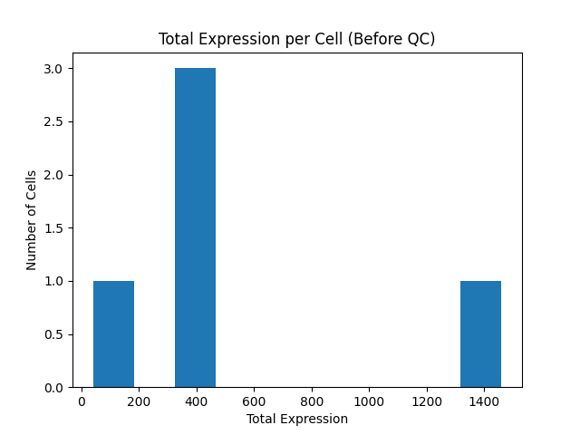
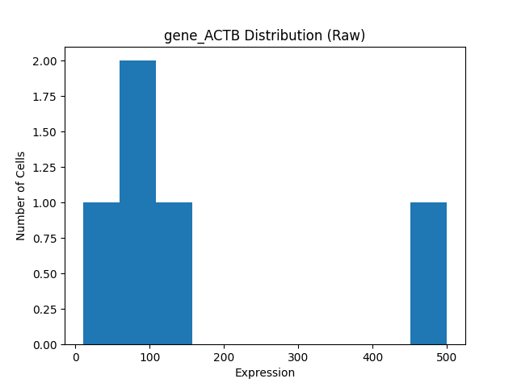
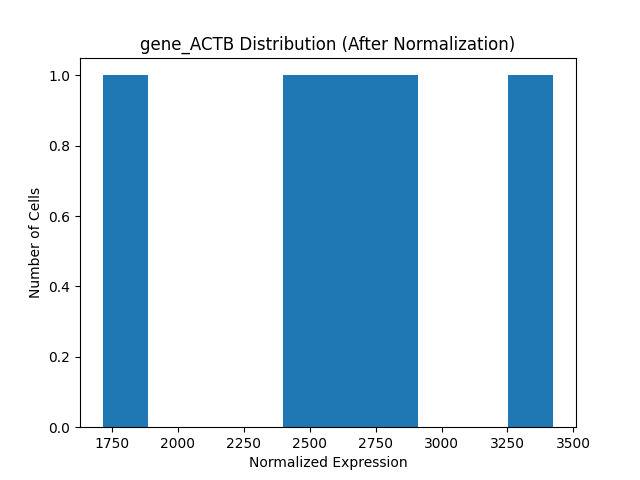

# Introductory Single-Cell Data Analysis Pipeline

This project is designed to simulate how a researcher
is introduced to single-cell data analysis in a real R&D team.

The goal is not to perform advanced bioinformatics analysis,
but to understand the learning structure:
how data is explored, cleaned, evaluated, and interpreted step by step.

## Step 1. Data Loading & Initial Exploration
Before performing any analysis, the first step is to understand the structure of data.
- How many cells are present?
- How many features(genes) exist?
- Are there obvious anomalies?

This mirrors the first task given to research intern: to familiarize themselves with the dataset before applying any methods.
I take a quick look at the dataset (`/data/expression_like_data.csv`) using the `describe()` function from pandas to understand its basic structure and summary statistics.

## Step 2. Quality Control (QC)

Not all cells in a single-cell dataset are suitable for analysis.
Some cells may have extremely low total expression, which often indicates
technical failure or poor-quality measurements.

In this pipeline, cells with a total expression below a defined threshold are excluded.
The exact threshold is not a fixed rule, but a decision based on data characteristics and analysis goals.

## Step 3. Normalization

Cells can have very different total expression counts due to technical factors(e.g., sequencing depth).
Directly comparing raw gene values across cells can be misleading.

To make cells comparable, this pipeline applied:
1) Library-size normalization: each cell is scaled to the same total count (10,000).
2) log1p transformation: reduces the impact of extreme values and stabilizes the distribution.

## Step 4. Visualization & Interpretation

Visualization is used not for presentation. It is for validation.

By comparing distributions before and after QC and normalization,
we can visually confirm:

- Low-quality cells are removed during QC.

- Normalization reduces variability caused by technical differences, making cells more comparable.

This step helps ensure that downstream analysis is based on reliable data.
